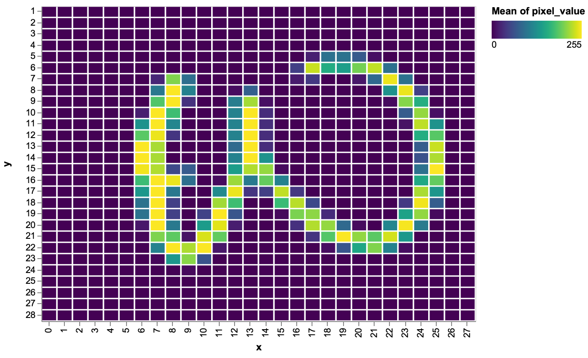

# Kaggle MNIST

Solutions for https://www.kaggle.com/c/digit-recognizer/data implemented with Kotlin.


## Data Prep

```bash
kaggle competitions download -c digit-recognizer

```





## Processing


```bash

talsync(){ 
srcDir=$(pwd | sed 's/\/Users\/brandl//g')
# continue here
}

rsync --delete -avx --exclude target --exclude build --exclude project ~/projects/deep_learning/kaggle_mnist/ brandl@talisker:~/projects/deep_learning/kaggle_mnist

rsync --delete -avx ~/.m2/  brandl@talisker:~/.m2

```

```bash
# screen -R kaggle_mnist

PRJ_SCRIPTS=~/projects/deep_learning/kaggle_mnist

cd ~/projects/deep_learning/kaggle_mnist_data

# http://www.gubatron.com/blog/2017/07/20/how-to-run-your-kotlin-gradle-built-app-from-the-command-line/

gradle -p ${PRJ_SCRIPTS} run 2>&1 | tee kaggle_mnist.$(date +'%Y%m%d').log

mailme "mnist done in $(pwd)"

```


## Cuda support

https://askubuntu.com/questions/917356/how-to-verify-cuda-installation-in-16-04

```bash
nvidia-smi
nvcc --version
```


## Misc


Kaggle submission whth

```bash
kaggle competitions submit -c digit-recognizer -f submission.csv -m "Message"
```